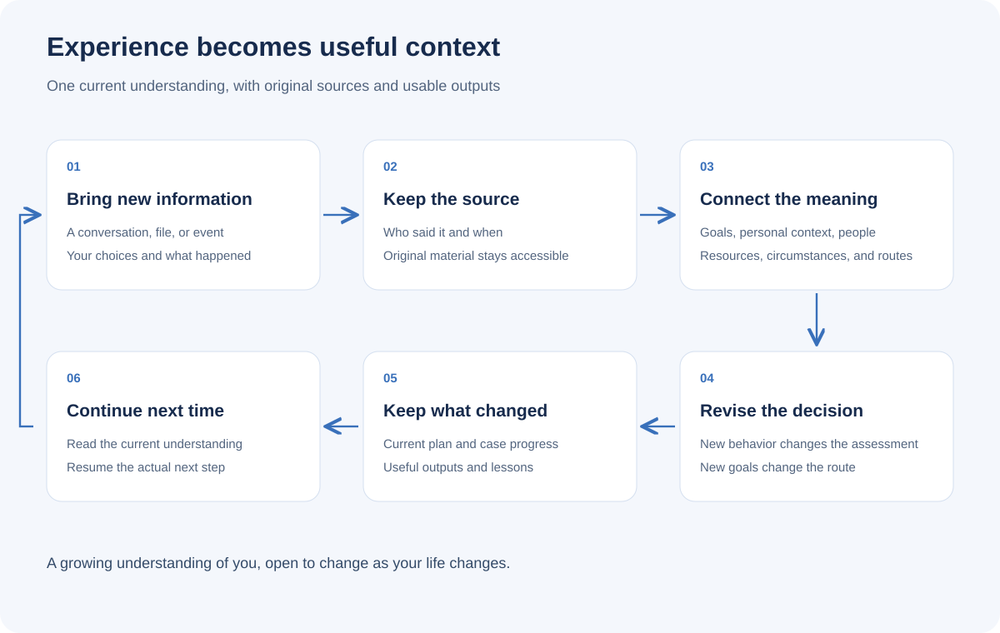

# Live Your Life Well

[简体中文](README.md) | English

> Start with one real situation. Build a life adviser that learns what matters to you.

[](VERSION.md)
[](LICENSE)

Work backward from the life you want. Understand your current stage, the people involved, and the resources available. Explore likely developments, choose a workable route, and produce what you need to act. Bring back what happened so the next decision can use a better understanding of you and your circumstances.

**Free and open source. For Doubao, WorkBuddy, Claude Code, Codex, and other Agents that support Skills.**

[Quick start](#quick-start) · [Install](#install) · [Capabilities](#capabilities) · [Full guide](docs/guide.en.md) · [Workspace](docs/architecture.en.md) · [Updates](CHANGELOG.md)


## What it helps with

| Your situation | What you get |
|---|---|
| A good job is drifting away from the life you want | A decision grounded in your goals, a transition route, and practical arrangements |
| Someone praises you but keeps expanding the work | An assessment of incentives and behavior, negotiation material, and alternatives |
| Circumstances are changing quickly | Main possible directions, timing, preparation, and signals to change course |
| Work, care, and personal projects compete for attention | A feasible overall plan and commitments to renegotiate |
| You feel overwhelmed and want to be understood | Listening, shared understanding, and support at your pace |
| You keep repeating the same background | Saved understanding, usable outputs, and a clear place to resume |

## Quick start

After installation, tell your Agent:

```text
Use zane-workbench.
My job pays steadily, but last-minute requests fill every day.
Over the next six months I want more time for family and my own writing.
Help me understand how this could develop and what to do now.
```

You get a recommendation and the reasoning that matters, followed by useful comparisons, arrangements, or a message draft. Continue with new facts, such as “They agreed, but haven't assigned a replacement yet,” to revise the same plan.

For a guided first task: `Use zane-workbench and help me get started.`

## Install

```bash
npx -y skills add ZanePan2027/zane-life-workbench -g --skill "*"
```

Or tell your Agent:

```text
Install all Skills from https://github.com/ZanePan2027/zane-life-workbench,
then use zane-workbench to help me with: …
```

See [installation and updates](docs/install.en.md) for Doubao, WorkBuddy, and Claude Code plugin instructions.

## Build your workspace

Open a folder you want to keep using in your Agent and say:

```text
Make this folder my life workspace.
Use the existing material to connect my goals, personal context,
people and circumstances, possible routes, and current actions.
Then help me with: …
```

Add relevant material or point to its existing location. The Agent organizes sources and saves useful results. Open the same project next time and say “Continue from last time.”



[Workspace and memory](docs/architecture.en.md) · [A full conversation](docs/guide.en.md) · [Start in chat](docs/chat-start.en.md)

## Capabilities

Use `zane-workbench` for everyday tasks. It selects methods as needed.

| Capability | Entry | Output |
|---|---|---|
| Life strategy, foresight, and action | `zane-workbench` | A route, timing and practical setting, usable outputs, and next steps |
| Clarify the task | `zane-question-intent-translator` | A clear question and request |
| Understand yourself | `zane-self-insight` | Insights grounded in experience and things to try |
| Emotional and psychological support | `zane-psychological-support` | Shared understanding, support, and preparation for counseling |
| Design an AI partner | `zane-agent-identity-card-builder` | Responsibilities, judgment, communication, and collaboration |
| Build and maintain a workspace | `zane-workbench-curator` | Organized sources, outputs, progress, and continuity |

See the [capability guide](docs/skill-inventory.en.md) for examples and outputs.

## Updates and feedback

Tell your Agent: `Update the Live Your Life Well workbench.`

Current release: **1.0**. Revision: **2026-09-19 · Long-term life adviser and complete workspace**. [Updates](CHANGELOG.md) · [Examples](docs/examples.md).

Share your task, experience, and suggested improvements in [Issues](https://github.com/ZanePan2027/zane-life-workbench/issues). [Contributing](CONTRIBUTING.md).

## Author and sources

By [Zane](https://github.com/ZanePan2027). The approach connects personal direction, circumstances, strategy, action, and learning from experience.

Design references include dontbesilent's task entry and complete user guide, strategy, game theory, governance, and behavioral science. [Sources](docs/provenance.md) · [MIT License](LICENSE).
