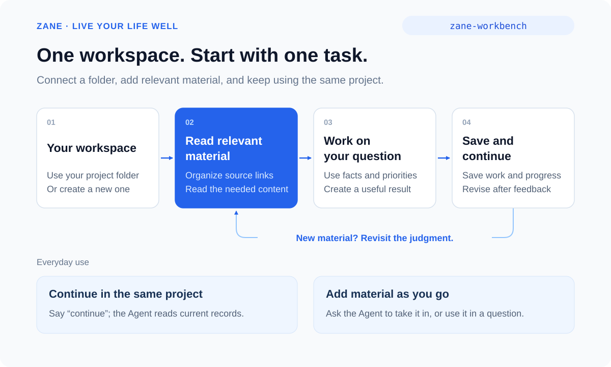

# Live Your Life Well

[简体中文](README.md) | English

> Turn your current situation into choices you can stand behind and actions you can follow through on.

[](VERSION.md)
[](LICENSE)

An AI life workbench that starts with what is happening now. Understand your situation, explore plausible futures, weigh choices, coordinate time and responsibilities, complete useful work, and adjust as life changes. You decide what living well means.

**Supports Doubao, WorkBuddy, Claude Code, Codex, and other Agents that support Skills. Free and open source.**

[Quick start](#quick-start) · [What it helps with](#what-it-helps-with) · [Guide](docs/guide.en.md) · [Skill directory](docs/skill-inventory.en.md) · [Installation and updates](docs/install.en.md)



**Start with `zane-workbench`: connect or create your workspace, then work on one real task.** Add the relevant material you have. The Agent organizes access, reads what the task needs, and helps you use it. You can also begin without files.

<a id="install"></a>

## Quick start

### 1. Install

Run in your terminal:

```bash
npx -y skills add ZanePan2027/zane-life-workbench -g --skill "*"
```

Or ask your Agent:

```text
Install all Skills from https://github.com/ZanePan2027/zane-life-workbench.
Then use zane-workbench to help me with this: ...
```

The command works with Agents listed in the installer, including Codex and Claude Code, and requires Node.js and `npx`. For Doubao or WorkBuddy, use the Agent request above and follow the [host-specific instructions](docs/install.en.md).

### 2. Connect or create your workspace

Open a project folder you want to keep using in your Agent, then say:

```text
Use zane-workbench. Set up my life workspace in the current folder.
Check the existing material and rules, create the entries I need,
and then help me with my current task.
```

An existing workspace is reused; an empty folder also works. If you have not chosen a location, say “This is my first time. Help me create a workspace.” The Agent helps you choose a location once.

### 3. Add material and start one task

Put relevant files in the workspace's material folder; new workspaces normally use `资料/`. You can also point the Agent to an existing authorized location. You do not need to sort everything or move your entire archive first.

```text
I am comparing two jobs. The offers and monthly expenses are in this workspace.
I care about financial stability and time with my family.
Find and read the relevant material, then compare workable arrangements
and the tradeoffs of each.
```

The Agent maintains navigation and source references, reads the relevant text, and creates a comparison, schedule, or other useful result. It asks for missing facts when they affect the judgment. With no files, describe your situation in the conversation; a complete life profile is not required.

### 4. Bring back changes and continue

```text
The first employer has confirmed two remote days per week.
Update the existing comparison and next step.
```

Workspace setup authorizes saving the task's relevant sources, results, and progress within its scope. Next time, open the same project and say “Continue the job comparison.” The Agent reads the current records without asking you to specify the folder again.

For a one-off question, edit, or conversation, you can start directly without setup.

## What it helps with

| What you can say | What you can get |
| --- | --- |
| Both jobs have advantages. Which fits my life now? | A comparison using your priorities, finances, time, and responsibilities |
| Given my goals and recent changes, what may happen next and how should I prepare? | Plausible directions, conditional choices, useful preparation, and signals to reconsider |
| Can work, family time, and study fit into this week? | A weekly plan, conflicts, and arrangements to change or discuss |
| I want to move. Where do I start? | Preparation and next steps based on your conditions |
| I keep returning to the same choices. What matters to me? | Tentative insights grounded in experience, with practical things to try |
| I feel upset. Please listen before offering advice. | Specific listening and shared understanding; exploration or a small change when wanted |
| The conditions changed. How do I continue? | Revised judgments, work, and a saved stopping point |

For decisions, start with the recommendation and its conditions, then the key tradeoff, next action, and signals to reconsider. Ask for a short comparison or a fuller analysis as needed.

Psychological support can start without workspace setup or questionnaires. It supports conversation, self-understanding, and preparation for professional care; it does not diagnose or replace treatment. Sensitive notes require explicit authorization. Platform chat retention depends on the service and its settings.

## Save and continue

Keep using the same workspace project. The Agent reads its records to recover the current judgment and next step. It asks for a location only when the project changes, access is lost, or several workspaces cannot be distinguished. When changing tools, open or authorize access to that same folder.

When you add material, ask the Agent to take it in or ask a question that uses it. The Agent reads the relevant content and updates its references.

In ordinary chat, save a continuation note and paste it back with the relevant material. See [starting in chat](docs/chat-start.en.md).

[Follow a job comparison](docs/guide.en.md)

## Use a specific method

Continue using `zane-workbench` for everyday tasks. Once familiar, you can directly select question clarification, self-reflection, psychological support, AI partner setup, or workspace organization. The [Skill directory](docs/skill-inventory.en.md) includes situations, example requests, and outputs.

## Version and feedback

Current release: **1.0**, revised **2026-09-19**. [Changes](CHANGELOG.md) · [Version checks](docs/testing.md).

Share your experience through Issues, with personal and company details removed.

## Provenance and license

The collection grew from question clarification, AI partner design, and self-reflection into a workflow for choices, action, feedback, and continuity.

See [Provenance](docs/provenance.md) for design references. This repository is released under the [MIT License](LICENSE).

Author: Zane
