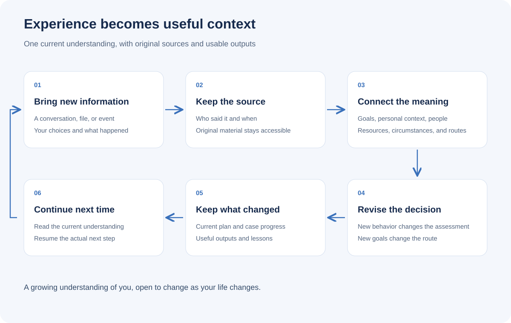

# Live Your Life Well

[简体中文](README.md) | English

> Start with one real situation. Build a life adviser that learns what matters to you.

[](VERSION.md)
[](LICENSE)

This is an AI workbench for living alongside you. Bring a choice, a relationship, a turning point, a recurring worry, or simply what happened today. It starts from the life you want, understands the situation you are in, explores what may happen next, helps you choose a workable route, and makes the next useful part with you.

It does not optimize your life for the best return. It helps you live the life you find worth living. An afternoon asleep in the sun with nothing to show for it can still be a day well lived, and you decide what counts. So it starts by getting to know you, in your own words: the life you want, what gives you energy, and where your lines are. Then it helps you get done what you care about.

You do not need a finished goal or organized files. Listening, rest, and being understood can be the whole point of a conversation. When you want to decide, it helps you think through the reasons, costs, timing, room to move, and exits. When you return, it continues from where real life paused.

**Free and open source. For Doubao, WorkBuddy, Claude Code, Codex, and other Agents that support Skills.**

[Quick start](#quick-start) · [Install](#install) · [Capabilities](#capabilities) · [Build a long-term workspace](#build-a-long-term-workspace) · [Full guide](docs/guide.en.md)


**The life you want → Current stage → People and circumstances → Possible futures → Routes, timing and practical setting → Useful work now → Adjust with feedback.**

## What it helps with

| Your situation | What you get |
|---|---|
| A good job is drifting away from the life you want | A decision grounded in your goals, a transition route, and practical arrangements |
| Someone praises you but keeps expanding the work | An assessment of incentives and behavior, negotiation material, and alternatives |
| Circumstances are changing quickly | Main possible directions, timing, preparation, and signals to change course |
| Work, care, and personal projects compete for attention | A feasible overall plan and commitments to renegotiate |
| You feel overwhelmed and want to be understood | Listening, shared understanding, and support at your pace |
| You keep repeating the same background | Saved understanding, usable outputs, and a clear place to resume |

## Quick start

After installation, tell your Agent:

```text
Use zane-workbench.
My job pays steadily, but last-minute requests fill every day.
Over the next six months I want more time for family and my own writing.
Help me understand how this could develop and what to do now.
```

You get a recommendation and the reasoning that matters, followed by useful comparisons, arrangements, or a message draft. Continue with new facts, such as “They agreed, but haven't assigned a replacement yet,” to revise the same plan.

You can also start with: `I am tired today. Stay with me for a while; I do not need advice yet.`

## Install

```bash
npx -y skills add ZanePan2027/zane-life-workbench -g --skill "*"
```

Or tell your Agent:

```text
Install all Skills from https://github.com/ZanePan2027/zane-life-workbench,
then use zane-workbench to help me with: …
```

See [installation and updates](docs/install.en.md) for Doubao, WorkBuddy, and Claude Code plugin instructions.

## Build a long-term workspace

If you want the Agent to remember this shared experience, open a folder you plan to keep using and say:

```text
Make this folder my life workspace.
Use what is already here to connect my direction, experience,
current situation, possible routes, and progress.
Then stay with me on this: …
```

Point the Agent to relevant material or add it to the folder. You do not need to sort your whole life first; it will gather what the current question needs. Open the same project next time and say “Continue from last time.”



[Workspace and memory](docs/architecture.en.md) · [A full conversation](docs/guide.en.md) · [Start in chat](docs/chat-start.en.md)

There is no long-term workspace requirement for a one-off question, a piece of writing, or a conversation.

## Let shared experience improve the next decision

For a decision worth revisiting, preserve your view and the Agent's advice, the evidence available to each, and what would change either judgment. When results arrive, the Agent checks what happened and which conditions changed, then revises the same plan. Its own mistakes are part of that review.

When an earlier experience seems relevant, compare the mechanism and the differences, including counterexamples, successful conditions, and skills you have gained. Keep talking naturally; the Agent handles the records. Listening, rest, and everyday experience can still be the whole purpose of a conversation.

When a concrete everyday question needs more options, the workbench can draw on [The High Value Life Guide](https://github.com/eternity4719/HowToLiveBetter), compare money, time and effort, and turn relevant evidence into a practical arrangement. Your goals and circumstances guide the choice.

## One companion, several kinds of help

Your main companion stays with the same ongoing story. The main companion understands the life you want, remembers what you have lived through together, holds the trade-offs, and brings real-world feedback back into the next decision. When useful, it can bring in a making partner for drafts and usable outputs, a research partner for source material, outside facts, and counterexamples, or a tool partner for external actions you have authorized.

These partners share your goal, current situation, and action boundaries. You can simply tell the story as it is; you do not need to dispatch roles or repeat your background to every Agent. Different perspectives are welcome, but they return to the same life direction and are integrated by the main companion.

## Capabilities

Use `zane-workbench` for everyday tasks. It selects methods as needed.

| Capability | Entry | Output |
|---|---|---|
| Life strategy, foresight, and action | `zane-workbench` | A route, timing and practical setting, usable outputs, and next steps |
| Clarify the task | `zane-question-intent-translator` | A clear question and request |
| Understand yourself | `zane-self-insight` | Insights grounded in experience and things to try |
| Emotional and psychological support | `zane-psychological-support` | Shared understanding, support, and preparation for counseling |
| Design an AI partner | `zane-agent-identity-card-builder` | Responsibilities, judgment, communication, and collaboration |
| Build and maintain a workspace | `zane-workbench-curator` | Organized sources, outputs, progress, and continuity |
| Find concrete everyday options | `life-decision-guide` | Relevant guide entries, candidate actions, and sources |

See the [capability guide](docs/skill-inventory.en.md) for examples and outputs.

## Updates and feedback

Tell your Agent: `Update the Live Your Life Well workbench.`

Product version: **2.0**. [Updates](CHANGELOG.md) · [Examples](docs/examples.md).

Share your task, experience, and suggested improvements in [Issues](https://github.com/ZanePan2027/zane-life-workbench/issues). [Contributing](CONTRIBUTING.md).

## Author and sources

By [Zane](https://github.com/ZanePan2027). The approach connects personal direction, circumstances, strategy, action, and learning from experience.

Design references include dontbesilent's task entry and complete user guide, strategy, game theory, governance, and behavioral science. [Sources](docs/provenance.md) · [MIT License](LICENSE).
