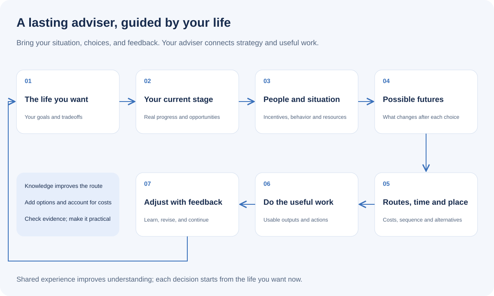
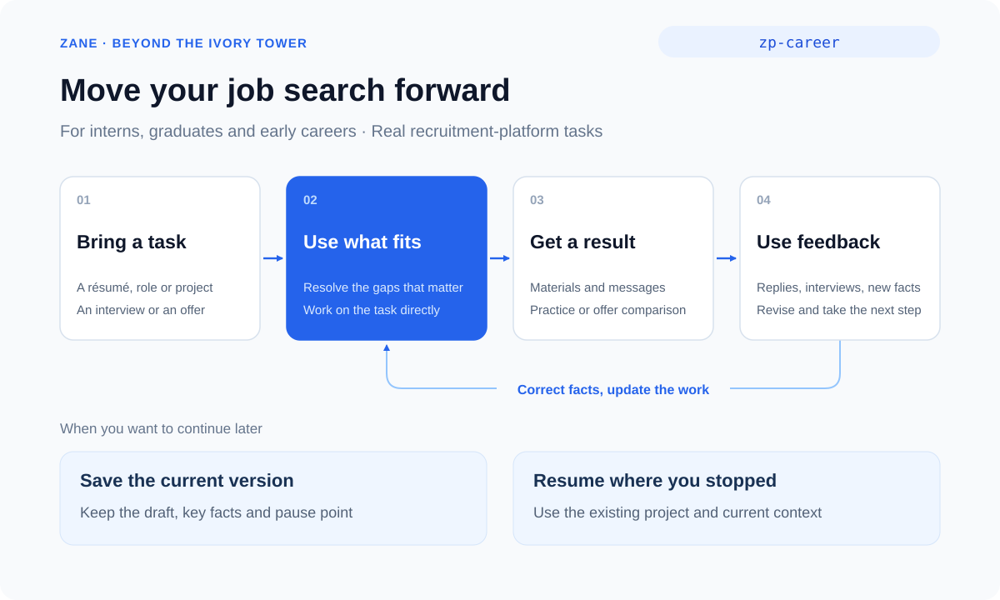

# zpskill

[简体中文](README.md) | English

> Zane's Life-Management Skills: one set helps you work out the life you want, the other helps you find the job.

[](VERSION.md)
[](LICENSE)

**Works with Doubao, WorkBuddy, Claude Code, Codex, and other Agents that support Skills.**

zpskill is created by [Zane](https://github.com/ZanePan2027). It holds two independent sets of Skills: Live Your Life Well (7) and Beyond the Ivory Tower (11).

[Quick start](#quick-start) · [Live Your Life Well](#live-your-life-well) · [Beyond the Ivory Tower](#beyond-the-ivory-tower) · [Install](#install) · [Changelog](CHANGELOG.md)

---

## Quick start

| I want to… | Use | Entry |
|---|---|---|
| Understand what life I want to live, handle choices, relationships and turning points, with something that keeps going over time | [Live Your Life Well](#live-your-life-well) (7 Skills) | `zp-life` |
| Find an internship or job: résumé, portfolio, applications, interviews, offers | [Beyond the Ivory Tower](#beyond-the-ivory-tower) (11 Skills) | `zp-career` |

[Install](#install) the set you need, then tell your Agent “Use <entry>, help me…”. You do not need to learn a method or organize files first.

---

## Live Your Life Well

> Get to know you first, then help you live a life you find worth living.

It does not help you live the most cost-efficient life. It helps you live the life you find worth living. An afternoon asleep in the sun with nothing to show for it can be a day worth having. So it first learns, in your own words, what life you want, what energizes you, and where your limits are, then helps you get the things you want done.

It follows one line: **the life you want → current stage → people and circumstances → possible futures → routes, timing and practical setting → useful work now → adjust with feedback.**



### What you bring, and what you get

| Your situation | What you get |
|---|---|
| A good job is drifting away from the life you want | A decision grounded in your goals, a transition route, and practical arrangements |
| Someone praises you but keeps expanding the work | An assessment of incentives and behavior, negotiation material, and alternatives |
| Circumstances are changing quickly | Main possible directions, timing, preparation, and signals to change course |
| Work, care, and personal projects compete for attention | A feasible overall plan and commitments to renegotiate |
| You feel stuck before starting something | The sticking point understood first, then one step you actually want to take, made doable |
| You feel overwhelmed and want to be understood | Listening, shared understanding, and support at your pace |
| You keep repeating the same background | Saved understanding, usable outputs, and a clear place to resume |

### Start with one message

```text
Use zp-life.
My job pays steadily, but last-minute requests fill every day.
Over the next six months I want more time for family and my own writing.
Help me understand how this could develop and what to do now.
```

You get a recommendation and the reasoning that matters, followed by the comparisons, arrangements, or message drafts you need. Continue with new facts, such as “They agreed, but haven't assigned a replacement yet,” and it revises the same plan. You can also start with: `I am tired today. Stay with me for a while; I do not need advice yet.`

To have it remember you over time, open a folder you plan to keep using and say “Set this folder up as my life workspace”. Next time say “Continue from last time”. It works without a workspace too.

### 7 Skills

Day to day you only need `zp-life`; the rest are used as the question requires.

| Skill | What you get |
|---|---|
| `zp-life` | Life strategy and foresight: a route, timing and practical setting, usable outputs, next steps |
| `zp-question` | A vague question turned into what you actually want to move forward |
| `zp-self` | Motives, values and recurring choices understood from real experience |
| `zp-support` | Emotional and psychological support; not a substitute for diagnosis or treatment |
| `zp-partner` | Responsibilities, judgment and collaboration for a long-term AI partner |
| `zp-workspace` | Build a workspace, organize sources, resume where you stopped |
| `zp-guide` | When you need concrete everyday options, consults the [How To Live Better guide](https://github.com/eternity4719/HowToLiveBetter) with sources |

More: [Manual](docs/life/README.en.md)

---

## Beyond the Ivory Tower

> From not knowing what to apply for, to writing the materials, getting to the interview, and judging the offer. Solve the job-search problem in front of you.

An AI job-search toolkit for every step before you start work, mainly for interns, new graduates and people with 1–2 years of experience; experienced people changing jobs can use it too. Bring an old résumé, a job description, project material, an interview question or an offer, say what you need, and start with the most urgent task.



### Tasks it handles

| Need | Result |
|---|---|
| Choose roles or find experience without internships | Role comparisons, honest material from school and projects, practical next steps |
| Find internships or interpret a job description | Search criteria, verifiable openings when access is available, eligibility and fit |
| Improve BOSS Zhipin profile and messages | Profile opening, supporting strengths, role-specific greeting and follow-up |
| Rebuild or localize a résumé | Content, layout and requested editable or export files |
| Create a portfolio | Work selection, case studies, documents or a website as needed |
| Prepare for tests and interviews | Practice, answer editing and one-question-at-a-time mock interviews |
| Compare offers and negotiate | Comparable compensation, questions to resolve and reply drafts |
| Prepare for signing and starting | Relevant document checks, questions and timing |

### Start with one message

```text
Use zp-career. Here are my old résumé and the role I want.
I mainly apply through BOSS Zhipin. Rework my résumé, write the opening
of my online profile, and draft a first message for this role.
Make an editable version first; I'll give feedback on it.
```

The Agent uses what you have provided and asks only about gaps that affect the result. It makes an editable candidate first, then revises with your feedback.

### 11 Skills

Day to day you only need `zp-career`; it reads the methods the task needs and completes it. Call a specific tool directly once you know it.

| Skill | What you get |
|---|---|
| `zp-career` | Single entry: direction, openings, platform messages, materials, interviews, offers, negotiation, pre-start prep |
| `zp-materials` | Résumé, portfolio and application entry points planned and made together |
| `zp-resume` | A résumé from scratch, or rewritten for a hiring market and language |
| `zp-greeting` | First message and follow-ups on BOSS Zhipin and similar platforms |
| `zp-portfolio` | Layered portfolio structure and bilingual application entry |
| `zp-site` | A personal portfolio site: reading path, visual design, responsive pages |
| `zp-editor` | Chinese case studies and long-form job-search writing edited to read like a person, keeping judgment and trade-offs |
| `zp-story` | Project stories told in proportion to the evidence, without overstating |
| `zp-qa` | Pre-publish checks across web, Word/PDF, links and numbers |
| `zp-redact` | Redact former-employer data and sensitive details before they go in a portfolio |
| `zp-design-prompt` | Turn design references into reusable generation prompts |

More: [Manual](docs/career/README.en.md) (including how to write for BOSS Zhipin and similar platforms)

---

## Install

Run in a terminal; Node.js and `npx` required.

**Life only:**

```bash
npx -y skills add ZanePan2027/zpskill -g --skill zp-life zp-workspace zp-question zp-partner zp-self zp-support zp-guide
```

**Career only:**

```bash
npx -y skills add ZanePan2027/zpskill -g --skill zp-greeting zp-career zp-editor zp-portfolio zp-materials zp-site zp-resume zp-design-prompt zp-story zp-redact zp-qa
```

**Both:**

```bash
npx -y skills add ZanePan2027/zpskill -g --all
```

**Claude Code plugin marketplace:**

```bash
claude plugin marketplace add ZanePan2027/zpskill
claude plugin install zpskill@zpskill
```

With the full set, Skills appear in chat prefixed with `zpskill:`, for example `zpskill:zp-life`. You can also install one Skill, for example `claude plugin install zp-career@zpskill`, which shows as `zp-career`. Just say “Use zp-life, help me…”; the full name is not required.

**Without the command line (Doubao, WorkBuddy, etc.):** tell your Agent “Install the Life Skills (7) from https://github.com/ZanePan2027/zpskill” (or the 11 Career Skills), then start a new chat and say “Use zp-life, help me…” or “Use zp-career, help me…”. Host-specific steps: [Life install](docs/life/install.en.md) · [Career install](docs/career/install.en.md).

---

## About

By [Zane](https://github.com/ZanePan2027). This method grew out of real life questions: direction, circumstances, futures, routes, action, feedback and shared experience.

This repository merges the former zane-life-workbench and zane-career-skills. Old URLs redirect here and the commit history is kept.

Share your task, experience, and suggested improvements in [Issues](https://github.com/ZanePan2027/zpskill/issues). [Contributing](CONTRIBUTING.md) · [Version](VERSION.md) · [Changelog](CHANGELOG.md) · [License](LICENSE) (MIT)
