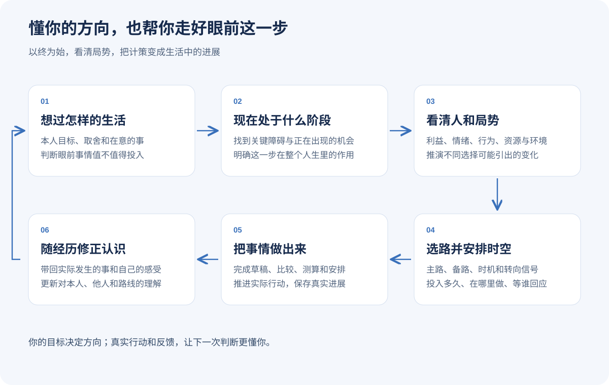

# 过好你的人生

简体中文 | [English](README.en.md)

> 把眼前的处境，变成愿意承担的选择和可以继续的行动。

[](VERSION.md)
[](LICENSE)

一个从眼前问题开始的 AI 人生工作台。帮助你理解处境、作出取舍、协调时间与责任、完成具体事情，并在现实变化后继续。怎样过好，由你自己定义。

**适用于 Claude Code、Codex，以及其他支持 Agent Skills 的工具。免费开源。**

[快速开始](#快速开始) · [可以处理的事](#可以处理的事) · [使用教程](docs/guide.md) · [能力目录](docs/skill-inventory.md) · [安装与更新](docs/install.md)



**第一次使用 `zane-workbench`，先连接或创建自己的工作台，再从一件事开始。** 把手头相关资料放进去即可，Agent 会整理入口、读取相关内容并帮你处理问题。没有资料也能开始。

<a id="安装"></a>

## 快速开始

### 1. 安装

在终端执行：

```bash
npx -y skills add ZanePan2027/zane-life-workbench -g --all
```

也可以直接告诉 Agent：

```text
请从 https://github.com/ZanePan2027/zane-life-workbench 安装全部 Skills，
然后使用 zane-workbench，帮我处理这件事：……
```

按安装界面选择使用的 Agent，完成后按宿主要求重载。命令安装需要 Node.js 和 `npx`；项目级安装与更新见[安装说明](docs/install.md)。

### 2. 连接或创建工作台

在 Agent 中打开一个准备长期使用的项目文件夹，然后说：

```text
请使用 zane-workbench，把当前文件夹设为我的人生工作台。
先看看已有资料和规则，帮我建立够用的入口，再处理我当前的问题。
```

已有工作台会直接沿用；空文件夹也能开始。如果还没选位置，告诉 Agent“我第一次使用，请带我创建一个工作台”，它会引导你确定一次保存位置。

### 3. 放入资料，开始一件事

把手头相关材料放进工作台的资料入口；新建工作台通常使用 `资料/`。也可以告诉 Agent 已有资料的位置，不用自己先分类或搬完全部历史。

```text
我在比较两份工作，条件和月度支出已经放在工作台里。
我想兼顾收支稳定和陪伴家人。
请先找到并阅读相关材料，再比较可行安排，说清各自需要承担什么。
```

Agent 会维护资料导航与来源引用，读取本次问题需要的正文，再形成比较、安排或其他成果。缺少影响判断的信息才追问。没有文件时，直接在对话里说明情况也可以；不必先填写完整人生档案。

### 4. 带回变化，继续处理

```text
刚确认第一份工作可以每周远程两天，请更新原来的比较和下一步。
```

建台授权范围内，本次相关来源、成果和进展会保存在工作台。下次在同一个项目里，直接说“接着上次的工作比较”。Agent 会读取当前记录继续，不需要每次重新指定文件夹。

只是临时问一个问题、修改文字或聊聊，也可以直接开始，不必先建台。

## 可以处理的事

| 你可以这样说 | 可以得到 |
| --- | --- |
| 两份工作各有好处，哪种更适合我现在的生活？ | 结合本人取舍、收支、时间与责任的比较 |
| 工作、陪家人和学习都想安排，这周放得下吗？ | 一周安排、冲突位置与需要调整或协商的事 |
| 想搬家，但不知道从哪里开始 | 按当前条件拆出的准备事项和下一步 |
| 我总在几种选择之间反复，想理解自己在意什么 | 根据具体经历形成的暂定认识和可以尝试的做法 |
| 上次的条件变了，这件事要怎么继续？ | 重算相关判断，更新成果与暂停点 |

## 怎样保存和继续

同一个工作台项目就是固定入口。Agent 会沿用已有资料与记录，恢复当前判断和下一步；只有换了项目、无法访问原文件夹，或存在多个工作台无法分辨时，才需要你重新定位。换工具时，在新工具中打开或授权访问同一个工作台。

有新资料时，告诉 Agent“把新资料收进工作台”，或直接提出与它有关的问题。Agent 会读取相关内容并更新入口。

在普通聊天中，可以先保存一份接续摘要，下次连同必要材料贴回来。具体做法见[聊天起步](docs/chat-start.md)。

[看一次完整的工作比较](docs/guide.md) · [更多任务示例](docs/examples.md)

## 按具体任务使用

日常继续使用 `zane-workbench`。熟悉后，可以直接选择问题澄清、自我认识、AI伙伴设定或工作台整理等方法；[能力目录](docs/skill-inventory.md)列出适用场景、输入示例和产出。

## 版本与反馈

当前为 **1.0 正式版**，本次修订日期为 **2026-09-17**。[更新记录](CHANGELOG.md) · [版本检查记录](docs/testing.md)。

欢迎通过 Issues 分享使用反馈，请先去除个人与公司敏感信息。

## 来源与许可证

这套方法从问题澄清、AI 伙伴设定和自我认识起步，逐步发展出选择、行动、反馈与接续的协作方式。

设计参考见 [来源说明](docs/provenance.md)。本仓库采用 [MIT License](LICENSE)。

作者：Zane
