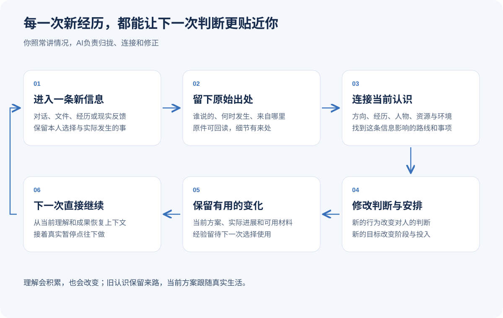

# 过好你的人生

简体中文 | [English](README.en.md)

> 从眼前一件事开始，成为越来越懂你的长期人生参谋。

[](VERSION.md)
[](LICENSE)

以你想过的生活为方向，看清当下的阶段、人和局势，推演接下来可能发生什么，选一条能走的路，并帮你把事情做出来。随着经历和反馈积累，工作台会修正对你的理解，让下一次判断更贴近你的生活。

**免费开源。支持豆包、WorkBuddy、Claude Code、Codex，以及其他支持 Skills 的 Agent。**

[快速开始](#快速开始) · [安装](#安装) · [能力一览](#能力一览) · [完整教程](docs/guide.md) · [工作台结构](docs/architecture.md) · [更新记录](CHANGELOG.md)


## 它能帮你做什么

| 眼前的处境 | 你会得到 |
|---|---|
| 工作待遇不错，却越来越偏离想过的生活 | 放回人生阶段的取舍、过渡路线和现实安排 |
| 对方嘴上认可你，实际总在加码 | 对利益、依赖和行为的判断，能用的协商办法与退路 |
| 局势变化很快，想提前准备 | 几种主要走向、时间窗口、提前动作和换路信号 |
| 工作、家庭和自己的事挤在一起 | 整体能实行的安排，以及要调整的投入和承诺 |
| 最近难受，想有人听懂自己 | 具体的倾听、共同理解，愿意时再探索或尝试改变 |
| 同样的背景讲过很多次，下一次还得重来 | 可接续的个人认识、当前方案、成果和实际进度 |

## 快速开始

安装后，直接告诉 Agent：

```text
使用 zane-workbench。
我现在的工作收入稳定，但每天被临时任务占满。
我希望半年后能腾出更多时间照顾家人，也保留自己的创作。
请结合我的处境，看看接下来可能怎样发展，现在怎么走。
```

它会先给当前建议和关键理由，再把需要的比较、安排或沟通稿做出来。你可以继续补充：“对方同意了，但还没安排接替的人”，让它更新原来的判断。

想先熟悉用法，可以说：`使用 zane-workbench，带我开始第一件事。`

## 安装

### 快速命令

```bash
npx -y skills add ZanePan2027/zane-life-workbench -g --skill "*"
```

### 直接告诉 Agent

```text
请从 https://github.com/ZanePan2027/zane-life-workbench 安装全部 Skills，
然后使用 zane-workbench，帮我处理这件事：……
```

豆包、WorkBuddy 的操作位置，以及 Claude Code 插件安装，见[安装与更新](docs/install.md)。

## 建立自己的工作台

在 Agent 中打开准备长期使用的文件夹，说：

```text
把当前文件夹设为我的人生工作台。
请结合已有资料建立方向、个人认识、局势、路线和行动的入口，
再帮我处理眼前这件事：……
```

相关材料直接放进资料入口，或告诉 Agent 已有位置。AI负责整理出处、连接当前问题、保存成果。下次在同一个项目里说“接着上次”，它会从实际暂停点继续。

日常对话逐渐形成这些信息：



[看完整目录与保存方式](docs/architecture.md) · [看一次多轮使用](docs/guide.md) · [普通聊天起步](docs/chat-start.md)

## 能力一览

日常使用 `zane-workbench` 即可，方法由当前任务决定。

| 能力 | 入口 | 主要产出 |
|---|---|---|
| 人生参谋、未来推演与行动 | `zane-workbench` | 推荐路线、时间空间、可用成果与下一步 |
| 理清当前真正要解决的事 | `zane-question-intent-translator` | 清楚的问题与可继续的请求 |
| 理解动机、价值与反复选择 | `zane-self-insight` | 来自具体经历的认识和尝试 |
| 情绪陪伴与心理支持 | `zane-psychological-support` | 共同理解、适合当下的支持与咨询准备 |
| 设定长期AI伙伴 | `zane-agent-identity-card-builder` | 职责、判断方式、表达和协作约定 |
| 建台、整理、重构与接续 | `zane-workbench-curator` | 可维护的目录、来源、成果与当前进展 |

每项能力的适用时机、输入示例和具体产出，见[完整能力目录](docs/skill-inventory.md)。

## 更新与反馈

直接对 Agent 说：`更新过好你的人生工作台。`

当前为 **1.0 正式版**，本次修订：**2026-09-19 · 长期人生参谋与完整工作台**。[更新记录](CHANGELOG.md) · [使用示例](docs/examples.md)。

欢迎在 [Issues](https://github.com/ZanePan2027/zane-life-workbench/issues) 分享你想完成的事、实际过程和希望改善的地方。[参与改进](CONTRIBUTING.md)。

## 作者与方法来源

作者：[Zane](https://github.com/ZanePan2027)。从具体生活问题中发展出方向、局势、路线、行动与持续认识的工作方式。

设计参考包括 dontbesilent 的任务入口与完整使用手册，以及战略、博弈、组织治理和行为科学。[方法来源](docs/provenance.md) · [MIT License](LICENSE)。
