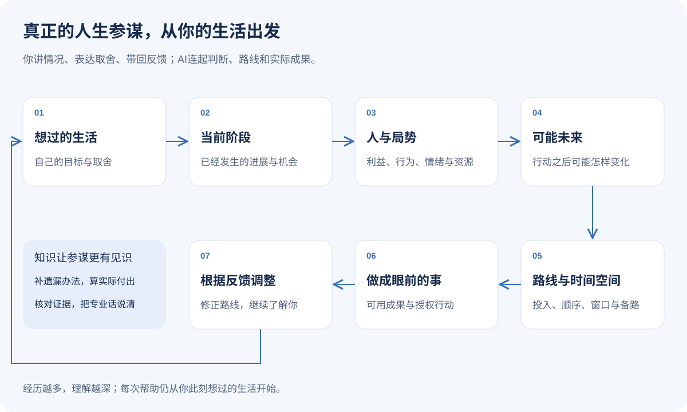
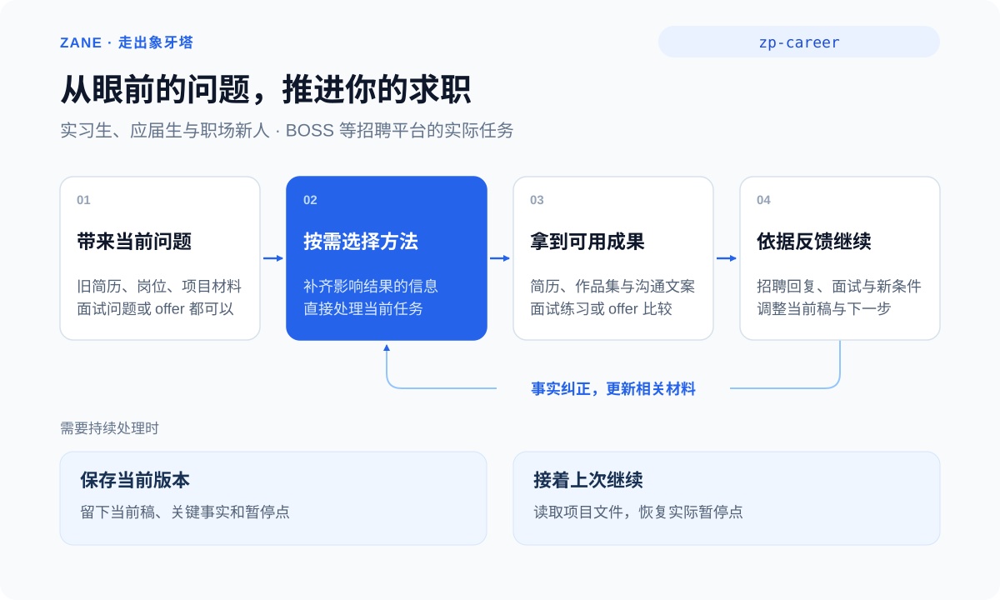

# zpskill

简体中文 | [English](README.en.md)

> **Zane的人生经营Skills**：先认识你想过的生活，再陪你把眼前的事做成，不辜负。

[](VERSION.md)
[](LICENSE)

**支持：豆包、WorkBuddy、Claude Code、Codex，以及其他支持 Skills 的 Agent。**

zpskill 由 [Zane](https://github.com/ZanePan2027) 创建，只做一件事：帮人更好地经营自己的人生。目前包含 20 个 Skills：主线「过好你的人生」9 个，人生里具体的一件事「找到工作」11 个。

[快速开始](#快速开始) · [安装](#安装) · [能力一览](#能力一览) · [怎样工作](#zpskill-怎样工作) · [使用手册](#使用手册) · [更新记录](CHANGELOG.md)



---

## zpskill 解决什么问题

它不帮你过性价比最高的人生，只帮你过你自己觉得值得的人生。一个下午晒着太阳睡一觉，没有任何产出，也可以是值得的一天。所以它先用你自己的话记住你想过怎样的生活、什么让你有劲、边界在哪里，再陪你把想做的事做成。

| 你带来的事 | 你会得到 |
|---|---|
| 工作不错，却越来越不像自己想过的生活 | 从人生阶段和真正想保留的东西出发，比较过渡路线与下一步 |
| 对方说认可你，实际却不断加码 | 看清利益、行为和依赖，准备能用的沟通、边界和退路 |
| 局势在变，想知道接下来可能怎样 | 推演几种主要走向，找出时间窗口、提前准备和换路信号 |
| 工作、家人、身体和自己的事撞在一起 | 看整体容量，排出实际放得下的安排，减少互相挤压 |
| 想做一件事，却总在开始前停住 | 先理解卡点，再把真正愿意做的一步变成可执行的东西 |
| 最近很难受，只想先有人听 | 具体地听懂你正在经历什么；什么时候探索、练习或求助，由你决定 |
| 同一背景不想每次重讲 | 保存共同经历、当前路线和成果，让下一次更懂你 |
| 眼前有一件具体的事要做成，比如找工作 | 从你想过的生活出发，把它拆成一步步能做的事；这类事有专门的工具，见下文「具体的事」 |

---

## 快速开始

只需要记住一个入口：`zp-life`。安装后，直接告诉 Agent：

```text
使用 zp-life，做我的长期人生参谋。
我现在的工作收入还可以，但每天被临时任务占满。
我希望半年后能腾出时间照顾家人，也保留自己的创作。
请从我想过的生活出发，看看接下来可能怎样发展，现在怎么走。
```

它会先给出现在的建议和关键理由，再把需要的比较、安排、测算或沟通文字做出来。你接着说“对方同意了，但还没有安排接替的人”，它会据此更新原来的判断。想先被听一听也可以：“我今天很累，先陪我聊聊，不急着给建议。”

已经知道眼前要做什么时，可以直接调用具体的 Skill：

```text
使用 zp-career。这是我的旧简历和想投的岗位，我主要用 BOSS 直聘，请帮我重做简历，并写好在线简历的开头和这个岗位的打招呼语。
使用 zp-resume，用这些经历做一份申请产品实习的英文简历。
使用 zp-judge，我想把后面的视频都重剪，但数据只有一百多次播放，要不要改？
使用 zp-check，AI 说它已经把事情发布了，帮我确认是不是真的。
使用 zp-self，我为什么总在快成功的时候放弃？
使用 zp-workspace，把当前文件夹设为我的人生工作台，然后陪我处理眼前这件事：……
```

想让它长期记得你，在 Agent 里打开一个准备长期使用的文件夹，让它建立人生工作台，下次说“接着上次”就能从原来的判断和下一步继续。没有工作台也能用，临时问题和倾诉直接开始。不需要先学方法，也不需要先整理资料。

---

## 安装

在终端执行，需要 Node.js 和 `npx`。

### 推荐：全部装上

```bash
npx -y skills add ZanePan2027/zpskill -g --all
```

安装后回到 Agent，说“使用 zp-life，帮我……”即可开始。

只想装一部分时：

**主线：过好你的人生（9 个）**

```bash
npx -y skills add ZanePan2027/zpskill -g --skill zp-life zp-workspace zp-question zp-judge zp-check zp-partner zp-self zp-support zp-guide
```

**求职：找到工作（11 个）**

```bash
npx -y skills add ZanePan2027/zpskill -g --skill zp-greeting zp-career zp-editor zp-portfolio zp-materials zp-site zp-resume zp-design-prompt zp-story zp-redact zp-qa
```

### Claude Code 插件市场

```bash
claude plugin marketplace add ZanePan2027/zpskill
claude plugin install zpskill@zpskill
```

整套安装后，Skill 在对话里以 `zpskill:` 开头出现，例如 `zpskill:zp-life`；也可以只装单个，例如 `claude plugin install zp-career@zpskill`，它显示为 `zp-career`。直接说“使用 zp-life，帮我……”即可，不必输全名。

### 不用命令行（豆包、WorkBuddy 等）

直接告诉 Agent “请从 https://github.com/ZanePan2027/zpskill 安装 zpskill 的全部 Skills”，装好后新建对话，说“使用 zp-life，帮我……”就能开始。各宿主的具体步骤见[人生安装页](docs/life/install.md)和[求职安装页](docs/career/install.md)。

### 更新

已安装时，重新执行上面的安装命令即可；也可以直接对 Agent 说：

```text
使用 zp-life，更新 zpskill
```

它会先告诉你这次改了什么，再更新。你自己的人生工作台和文件不会被改动，只替换 Skill 本身。版本变化见[更新记录](CHANGELOG.md)。

---

## 能力一览

### 主线：过好你的人生

日常只需要 `zp-life`，其余按当前问题自动调用。

| 入口 | 你会得到 |
|---|---|
| `zp-life` | 人生参谋、未来推演：推荐路线、时间空间、实际成果和下一步 |
| `zp-question` | 把模糊的问题理清成真正要推进的事 |
| `zp-judge` | 对“要不要改／要不要做”先判断成不成立，两边都让反方说满，再给改、不改或再观察与一个最小实验；数据少时不会只说“再等等” |
| `zp-check` | 复核 AI 的进展和产出：AI 说做完了怎么确认、越聊越偏怎么重开、AI 总说好怎么办 |
| `zp-self` | 从具体经历理解自己的动机、价值和反复出现的选择 |
| `zp-support` | 情绪陪伴与心理支持，不替代诊断或治疗 |
| `zp-partner` | 设定长期 AI 伙伴的职责、判断方式和协作约定 |
| `zp-workspace` | 建台、整理资料、接续上次停下的地方 |
| `zp-guide` | 需要具体生活办法时，按需参考《[高性价比人生指南](https://github.com/eternity4719/HowToLiveBetter)》并给出处 |

### 具体的事：找到工作



找工作是人生里很具体的一件事。这套 AI 求职工具箱陪你走完入职前的每一步，重点服务实习生、应届毕业生和工作 1—2 年的新人，有经验、正在换工作的人也可以用。日常只需要 `zp-career`，它按当前任务读取方法并直接完成；熟悉后可以直接调用专项工具。

| 入口 | 你会得到 |
|---|---|
| `zp-career` | 统一入口：方向、找岗位、平台沟通、材料、笔面试、offer、谈薪和入职前准备 |
| `zp-materials` | 一起完成简历、作品集和投递入口，并安排各自分工 |
| `zp-resume` | 从零做简历，或按招聘市场和语言重写 |
| `zp-greeting` | BOSS 直聘等平台的首条招呼语与后续沟通 |
| `zp-portfolio` | 设计作品集的分层结构与双语投递入口 |
| `zp-site` | 个性化作品集网站：阅读路径、视觉与响应式页面 |
| `zp-editor` | 把中文案例和求职长文改得像真人写的，保留判断与取舍 |
| `zp-story` | 按证据强度讲项目故事，不夸大 |
| `zp-qa` | 发布前检查网页、Word/PDF、链接和数据口径是否一致 |
| `zp-redact` | 脱敏前公司数据与敏感信息，再放进作品集 |
| `zp-design-prompt` | 把设计参考图转成可复用的生成提示 |

之后的工作台和工具，也都放在这里，不另起炉灶。

---

## zpskill 怎样工作

```text
你想过的生活
   ↓
当前阶段 · 人与局势
   ↓
可能未来
   ↓
路线 · 时间 · 空间
   ↓
做成眼前的事（比如找到工作）
   ↓
根据现实反馈继续调整
```

zpskill 每次只处理你当前的一件事。重要的决定会分别留下你的想法、AI 的建议、各自依据和会改变判断的信号；现实回来后，先修当前方案，再看哪些认识值得保留。

---

## 使用手册

装好之后怎样把它用好：[过好你的人生（主线）](docs/life/README.md) · [找到工作（求职篇）](docs/career/README.md)

---

## 作者与支持

作者：[@ZanePan027](https://x.com/zanepan027) · [小红书](https://xhslink.cn/o/7CiaOyzr6UO) · [抖音](https://v.douyin.com/k3MsOVPRIKY)

如需加入社群，可扫码或打开 [社群说明](https://mp.weixin.qq.com/s/w0TrK3N4XDiOSdrQ-iB0vQ)。


## 许可证

本项目采用 [MIT](LICENSE) 许可证。

- 个人使用、学习、研究与商业项目都可以直接使用。
- 复制或再分发时，请保留版权与许可声明。
- 软件按“原样”提供，不含任何担保。
