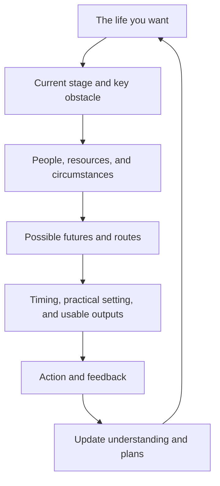

# How your workspace grows

[简体中文](architecture.md) · [Home](../README.en.md)

Start with the current situation and connect useful information into a map for future decisions.

| Workspace area | What it holds |
|---|---|
| Direction | Desired life, current stage, and tradeoffs |
| Personal context | Your words, experiences, preferences, and relevant life areas |
| Circumstances and strategy | People, resources, environment, possible futures, routes, and lessons |
| Cases | Progress, actions, feedback, next steps, and output links |
| Material | Original sources and ready-to-use outputs |
| Collaboration | Partner roles, memory, and continuity |
| Inbox | Incoming material |

A first workspace can start small. A full workspace provides these areas; existing projects are connected using their actual structure. An explicit restructuring request includes migration and updated links.

## From feedback to a better decision

“They assigned a replacement” changes the assessment of the person and the cooperation route. “My goal changed” changes the current stage and related commitments. The Agent updates the existing case and usable outputs.

Current understanding links back to your words and original material. History preserves the reasoning at the time. A new conversation reads the current record and resumes the actual next step.

## Working together

One lead Agent carries the task through. Research, production, and organization can provide focused help when useful. The result returns to the same plan and record. You can give a long-term partner a preferred voice and emphasis.

You describe events, make choices, and bring back feedback. The Agent organizes material, prepares outputs, and maintains continuity.
