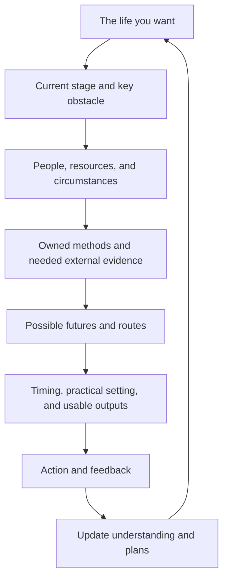

# How your workspace grows

[简体中文](architecture.md) · [Home](../README.en.md)

Start with the current situation and connect useful information into a map for future decisions. Your goals and real feedback are the main system; the owned knowledge layer keeps reusable methods, and the external guide is only an evidence entry when needed.

```mermaid
flowchart TD
 A[The life you want] --> B[Current stage and key obstacle]
 B --> C[People, resources, and circumstances]
 C --> D[Owned methods and needed external evidence]
 D --> E[Possible futures and routes]
 E --> F[Timing, practical setting, and usable outputs]
 F --> G[Action and feedback]
 G --> H[Update understanding and plans]
 H --> A
```

The complete local workbench uses `工作台/` as its canonical root. `00_入口` is navigation; the nine layers below each have one responsibility.

| Workspace area | What it holds |
|---|---|
| `01_方向` | Desired life, current stage, and tradeoffs |
| `02_本人` | Your words, experiences, preferences, and relevant life areas |
| `03_处境` | People, resources, environment, possible futures, and lessons |
| `04_知识` | Owned methods, source registry, conditions, and counterexamples |
| `05_决策` | Current route, alternatives, and switching signals |
| `06_行动` | The unique event state, actions, feedback, and output links |
| `07_资产` | Original material, content, products, and usable outputs |
| `08_系统` | Rules, roles, tools, collaboration, and continuity |
| `09_收件箱` | Incoming and unclassified material |

`00_入口` only navigates; it does not become a second state store. Event JSON files hold the unique reality state, while routes, views, and notes link back to them. Existing projects are connected using their actual structure; an explicit restructuring request includes migration and updated links. The external guide is not required to create a workspace and is never copied in full.

## From feedback to a better decision

“They assigned a replacement” changes the assessment of the person and the cooperation route. “My goal changed” changes the current stage and related commitments. The Agent updates the existing case and usable outputs.

Current understanding links back to your words and original material. History preserves the reasoning at the time. A new conversation reads the current record and resumes the actual next step.

## Let shared experience improve the next decision

For a decision worth revisiting, preserve your view and the Agent's advice, the evidence available to each, and what would change either judgment. When results arrive, the Agent checks what happened and which conditions changed, then revises the same plan. Its own mistakes are part of that review.

When an earlier experience seems relevant, compare the mechanism and the differences, including counterexamples, successful conditions, and skills you have gained. Keep talking naturally; the Agent handles the records. Listening, rest, and everyday experience can still be the whole purpose of a conversation.

## Working together

One lead Agent carries the task through. Research, production, and organization can provide focused help when useful. The result returns to the same plan and record. You can give a long-term partner a preferred voice and emphasis.

You describe events, make choices, and bring back feedback. The Agent organizes material, prepares outputs, and maintains continuity.
