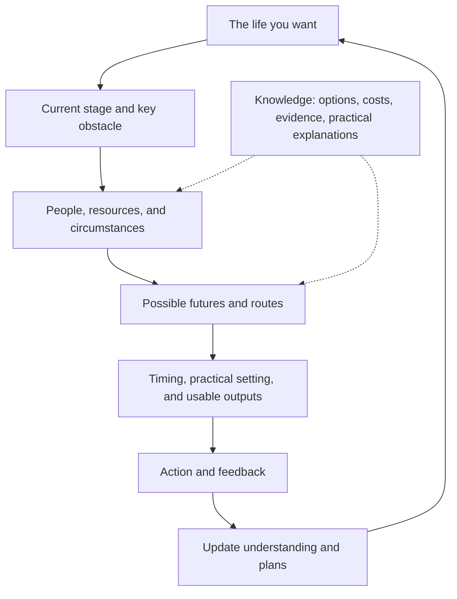

# How your workspace grows

[简体中文](architecture.md) · [Home](../README.en.md)

Start with the current situation and connect useful information into a map for future decisions. Start from the life you want, understand your stage and the people involved, explore possible futures, and turn a route into useful work. Knowledge adds overlooked options, full costs, key evidence, and practical explanations.

```mermaid
flowchart TD
 A[The life you want] --> B[Current stage and key obstacle]
 B --> C[People, resources, and circumstances]
 C --> E[Possible futures and routes]
 K[Knowledge: options, costs, evidence, practical explanations] -.-> C
 K -.-> E
 E --> F[Timing, practical setting, and usable outputs]
 F --> G[Action and feedback]
 G --> H[Update understanding and plans]
 H --> A
```

Start in your chosen folder with navigation, incoming material, and the current case. Add direction, personal context, circumstances, routes, and outputs as needed; the Agent adapts to the actual structure.

| Workspace area | What it holds |
|---|---|
| Direction | Desired life, current stage, and tradeoffs |
| Personal context | Your words, experiences, and preferences |
| Circumstances | People, resources, possible developments, and lessons |
| Knowledge | Reusable methods, conditions, counterexamples, and sources |
| Decisions | Current route, alternatives, and switching signals |
| Action | Progress, feedback, next steps, and output links |
| Assets | Original material and usable outputs |
| System | Roles, collaboration, and continuity |
| Inbox | Incoming material |

Start with the parts the current task needs, then grow with real use. Bring material and feedback; the Agent connects them to the same case, route, and usable outputs.

## From feedback to a better decision

“They assigned a replacement” changes the assessment of the person and the cooperation route. “My goal changed” changes the current stage and related commitments. The Agent updates the existing case and usable outputs.

Current understanding links back to your words and original material. History preserves the reasoning at the time. A new conversation reads the current record and resumes the actual next step.

## Let shared experience improve the next decision

For a decision worth revisiting, preserve your view and the Agent's advice, the evidence available to each, and what would change either judgment. When results arrive, the Agent checks what happened and which conditions changed, then revises the same plan. Its own mistakes are part of that review.

When an earlier experience seems relevant, compare the mechanism and the differences, including counterexamples, successful conditions, and skills you have gained. Keep talking naturally; the Agent handles the records. Listening, rest, and everyday experience can still be the whole purpose of a conversation.

## Working together

One lead Agent carries the task through. Research, production, and organization can provide focused help when useful. The result returns to the same plan and record. You can give a long-term partner a preferred voice and emphasis.

You describe events, make choices, and bring back feedback. The Agent organizes material, prepares outputs, and maintains continuity.
