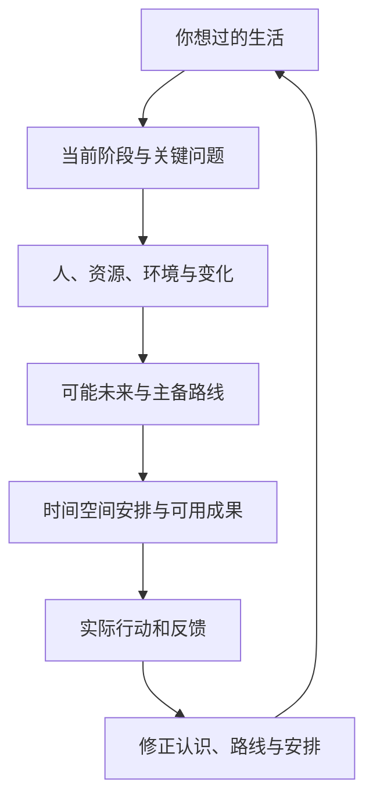

# 你的工作台怎样生长

[English](architecture.en.md) · [首页](../README.md)

从当前问题开始，逐渐把有用信息接成一张能帮助选择的地图。

## 文件怎样归拢

| 位置 | 帮你保留什么 |
|---|---|
| 方向与取舍 | 想过的生活、当前阶段与取舍 |
| 个人底图 | 本人原话、经历、偏好和相关生活领域 |
| 局势与推演 | 人物、资源、环境、可能走向、路线和经验 |
| 事项 | 当前进展、实际动作、反馈、下一步及成品入口 |
| 资料 | 原始材料和可直接使用的成果 |
| 协作与运行 | AI伙伴如何配合、保存与接续 |
| 收件箱 | 新材料进入的位置 |

首次建立可以从几个入口起步；完整建台形成上述结构。已有工作台会按实际目录连接，明确要求重构时再完成迁移。

## 一条新信息怎样产生作用

你说“对方已安排了接手人”，AI会保留这条反馈，更新人物判断和合作路线，把新的下一步写回同一事项。你说“我的目标变了”，它会重新比较相关投入，修改当前阶段、路线和成果。

当前理解能回到原话与原件，历史保留当时为什么那样想。新会话从当前入口读取，继续真实暂停点。跨事项有用的经验会提炼成下次能采用的方法。

## AI怎样配合

一个主持者连续承接你的问题，按需要获得调查、制作或整理方面的帮助。每次协作有明确问题和交付，最终回到同一份方案与进展。长期伙伴可以设置独特的判断侧重与口吻。

你只需要讲情况、表达取舍、带回现实变化。AI负责资料归拢、方案制作和记录维护。
