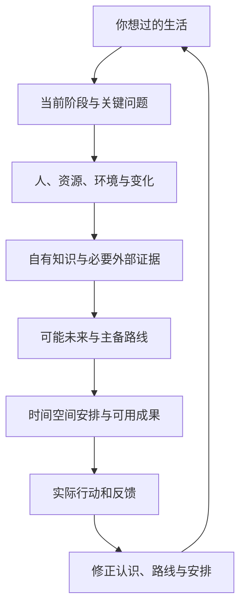
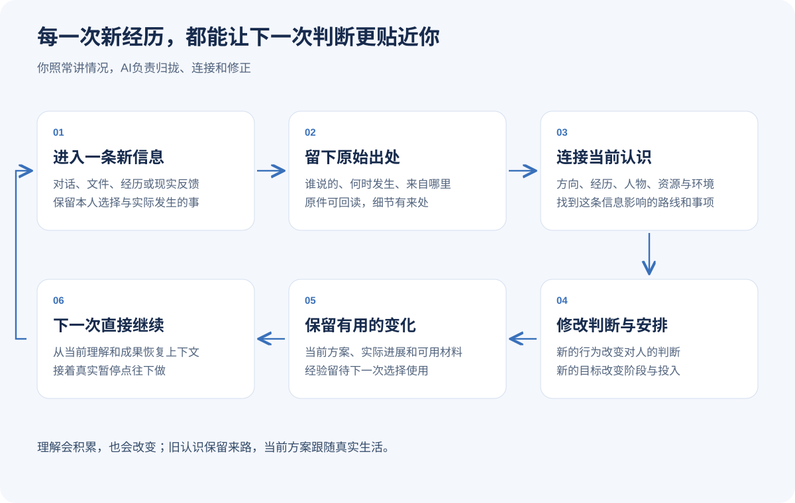

# 你的工作台怎样生长

[English](architecture.en.md) · [首页](../README.md)

从当前问题开始，逐渐把有用信息接成一张能帮助选择的地图。本人目标和现实反馈是主系统，自有知识层沉淀可复用方法，外部指南只在需要时提供证据入口。

```mermaid
flowchart TD
  A[你想过的生活] --> B[当前阶段与关键问题]
  B --> C[人、资源、环境与变化]
  C --> D[自有知识与必要外部证据]
  D --> E[可能未来与主备路线]
  E --> F[时间空间安排与可用成果]
  F --> G[实际行动和反馈]
  G --> H[修正认识、路线与安排]
  H --> A
```

## 文件怎样归拢

完整本地工作台以 `工作台/` 为规范根目录；`00_入口` 是导航，下面九层分别承担一项职责。

| 位置 | 帮你保留什么 |
|---|---|
| `01_方向` | 想过的生活、当前阶段与取舍 |
| `02_本人` | 本人原话、经历、偏好和相关生活领域 |
| `03_处境` | 人物、资源、环境、可能走向与经验 |
| `04_知识` | 自有方法、来源注册、适用条件与反例 |
| `05_决策` | 当前路线、备选路线与转向信号 |
| `06_行动` | 唯一事件状态、动作、反馈与成果入口 |
| `07_资产` | 原始材料、内容、产品与可用成果 |
| `08_系统` | 规则、角色、工具、协作与接续 |
| `09_收件箱` | 新材料进入与待归位位置 |

`00_入口` 只负责导航，不保存第二套状态；事件 JSON 是现实执行的唯一状态，路线、视图和说明都回到它。已有工作台按实际目录连接，明确要求重构时再完成迁移。外部指南不是建台前置条件，也不会被整本复制进用户工作台。

## 一条新信息怎样产生作用

你说“对方已安排了接手人”，AI会保留这条反馈，更新人物判断和合作路线，把新的下一步写回同一事项。你说“我的目标变了”，它会重新比较相关投入，修改当前阶段、路线和成果。

当前理解能回到原话与原件，历史保留当时为什么那样想。新会话从当前入口读取，继续真实暂停点。跨事项有用的经验会提炼成下次能采用的方法。

## 让共同经历改善下一次帮助

重要决定可以分别留下你的看法与AI的建议，以及各自依据和会改变判断的反馈。结果回来后，AI先核实际发生与条件变化，再修正同一份方案；它自己的误判也会进入修正。

遇到相似选择时，工作台会对照旧经历与现在的不同，查看反例、成功条件和已经发生的成长。你继续自然地讲情况，AI负责归拢。倾诉、休息和体验仍可直接成为本次帮助的全部。

## AI怎样配合

一个主持者连续承接你的问题，按需要获得调查、制作或整理方面的帮助。每次协作有明确问题和交付，最终回到同一份方案与进展。长期伙伴可以设置独特的判断侧重与口吻。

你只需要讲情况、表达取舍、带回现实变化。AI负责资料归拢、方案制作和记录维护。
